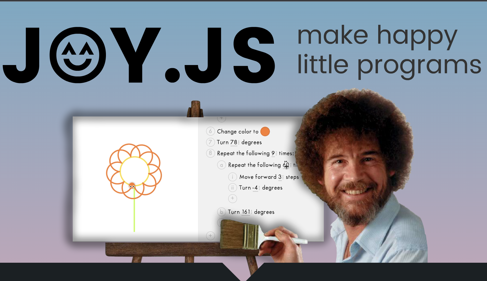

## Joy Editor
Joy is programmable painting tool that is really use to learn and share/remix your creations.

This editor is based on the [Joy](https://ncase.me/joy/) project by [Nicky Case](https://ncase.me/).

### Support

Need help? Please [open an issue](https://github.com/seflless/joy-vscode/issues/new) for support.

